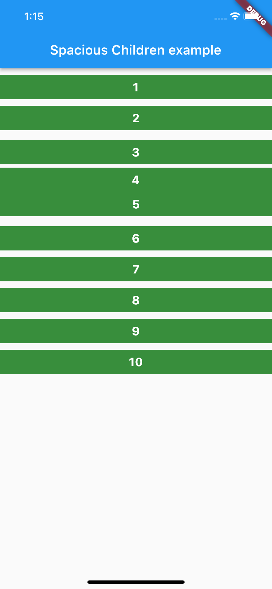

A library to insert `SizedBox` between every children widget in Column, Row, and any List of widgets.

## Getting started

#Add dependency
```yaml  
dependencies:  
 spacious_widgets: 1.0.0
 ```  

## Features

* Single extension function to add SizedBox between every widgets in a `List`
* Adjust any single inserted `SizedBox`
* Ignore `SizedBox` anywhere
* Doesn't insert `SizedBox` around `Spacer` widget

## Usage

```dart  
List<Widget> setSpace({double? start, double? height, double? width, double? end});  
```  

Normally to add space between widgets we use `SizedBox` between every widget.

```dart  
Column(  
   children: [
      Text("A"),
      SizedBox(height: 10),
      Text("B"),
      SizedBox(height: 10),
      Text("C"),
      SizedBox(height: 10),
      Text("D"),
      SizedBox(height: 10),
      Text("E"),
   ],
)  
```  

This is tedious when the List gets bigger. For any n widgets, we have to put n-1 `SizedBox`, and if we need space at the start and end we need n+1 `SizedBox`

So with this library the `SizedBox` is added automatically, so the actual List is not cluttered with `SizedBox`.

```dart  
Column(  
   children: [
      Text("A"),
      Text("B"),
      Text("C"),
      Text("D"),
      Text("E"),
   ].setSpace(height: 10),
)  
```  

The above inserts `SizedBox(height: 10, width: null)` between every widget.

For `Row` use `setSpace(width: 10)` which inserts `SizedBox(width: 10, height: null)`.

`start` inserts `SizedBox` before the first widget, `end` inserts `SizedBox` after the last widget

```dart  
[  
   ...widgets
].setSpace(start: 15, height: 10, end: 15),  
```  

The `start` and `end` parameter requires `height` or `width` parameter to be set.  
`start` and `end` overrides the `height` or `width` value.
To only insert `SizedBox` at the start and end, set `height` or `width` to `0`

## Adjustments

To adjust the `height` or `width` in the inserted `SizedBox`, use the widgets `AdjustSpace` and `NoSpace`

```dart  
Column(  
    children: [
        Text("A"),
        AdjustSpace(adjust: 10),   // increase 10 in the height
        Text("B"),
        AdjustSpace(adjust: -5),   // decrease 5 in the height
        Text("C"),  
        AdjustSpace(override: 20), // override the height
        Text("D"),
        NoSpace(),                 // don't insert SizedBox here
        Text("E"),
        Text("F"),
    ].setSpace(start: 15, height: 10, end: 15),
)  
```  

## Example


## License

MIT

## Development

Please raise an issue if you found any problems, have any features or optimization ideas in the . I'm happy to learn and co-operate.